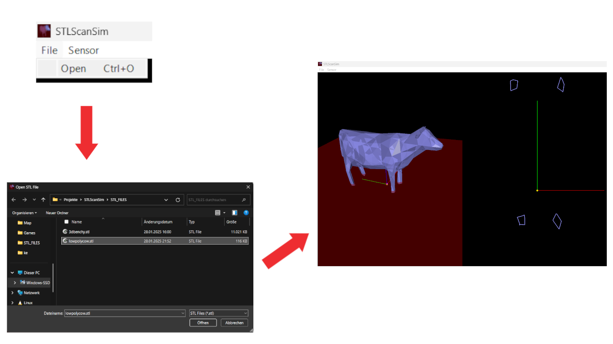
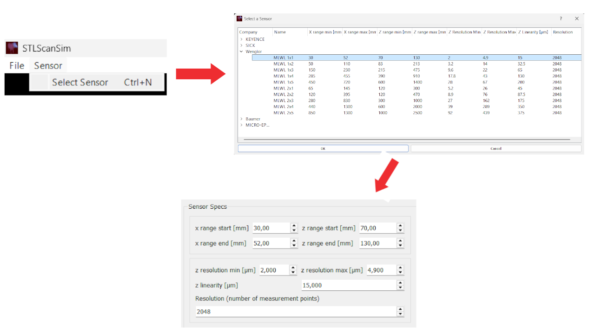
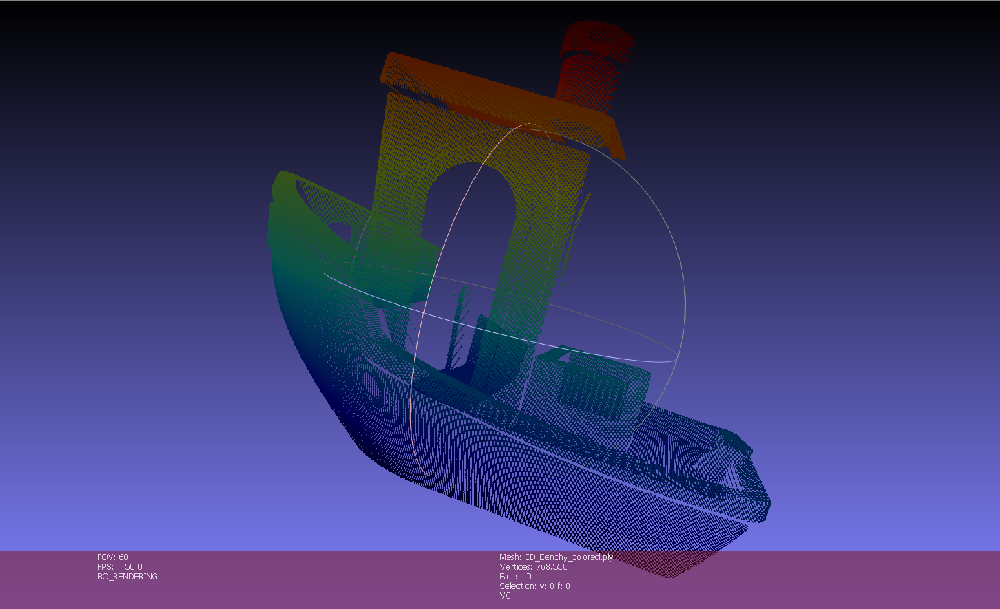

# STLScanSim
STLScanSim is a powerful tool for simulating 3D scanning processes with 2D laser-line sensors. It offers a virtual environment to test sensor configurations, perform ray tracing, and generate point clouds, helping users test scanning setups without requiring expensive hardware.

## Requirements
The software has been tested with Python 3.12.8.
To install the required libraries run the following command in the Root Folder of STLScanSim:
```
pip install -r requirements.txt
```
To reach the UI execute MainUI.py
```
python MainUI.py
```
## Usage
1. Load an STL file into the application by clicking **File** and then **Open**.
   A file explorer will open with the initial directory set at **STL_FILES**.
   Select your STL file and press open, it should not be shown in the 3D view on the left.
   

2. Configure the sensor parameters by either selecting a preset or creating your own sensor profile.
   To select one of the presets you need to first click on **Sensor** and then **Select Sensor**. Select one from the shown companies. 
   
   To add sensors or change existing ones navigate to the file sensors.json.
   Some values are set to 0.1µm or 0µm because those values couldnt be found in their datasheets.

3. Position the sensor with the parameters from the Groupbox labeled **Sensor position**.
   The x, y and z position define the origin point of the sensor. The polar, azimuth and sensor angle define the sensors measurement direction.

4. Define the endpoint and the number of your measurement in the Groupbox labeled **Measurement**.
   The white measurement line will show you the path the sensor will take.
   Once you set up the measurement click **Start Measurement**. A dialog will appear showing you the progress.
   When the measurement is done, the created PLY file will be saved to the Measurements folder with the
   index incremented.

## Sample
As an example, as to what can be achieved with the simulation a 3DBenchy was scanned.
The resulting PLY file is visualized with meshlab:

